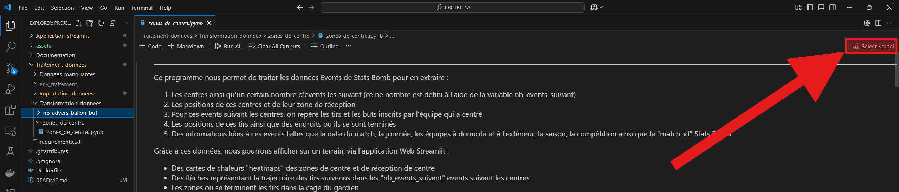

# Comment prendre en main le projet ?

Nous allons vous expliquer comment utiliser ce projet après avoir cloner ce repository en local sur son PC.

## 1) Faire fonctionner l'application avec Docker

Tel qu'est implémenté ce projet/repository, il est possible de faire fonctionner l'application Streamlit sans aucune exécution de programme ou manipulation de données.  
En effet, pour run, l'application à seulement besoin de données stockées dans une base de données nommée "database.db", située dans le dossier "Application_streamlit".  
Afin de faire fonctionner l'application sur n'importe quel système d'exploitation, sur n'importe quel PC, nous avons mit en place un conteneur **DOCKER**, c'est-à-dire que nous avons créé un "Dockerfile".  
Pour utiliser ce conteneur, il faut :
1) Avoir Docker installer sur son pc
2) Lancer le logiciel Docker Desktop
3) Ouvrir un terminal
4) Se placer dans à la racine du projet (le dossier dans contenant le repository, normalement nommé "PROJET-4A"
5) Créer l'image Docker avec la commande : "docker build -t *tag_image_docker* ." (par exemple "docker build -t docker_projet_4a .")
6) Lancer le conteneur avec la commande : "docker run -p 8501:8501 *tag_image_docker*" (par exemple "docker run -p 8501:8501 docker_projet_4a")
7) Si une fenêtre de sécurité s'affiche, cliquer sur "Autoriser"
8) Pour lancer l'application dans le navigateur, cliquer sur le lien "Local URL" dans le terminal ou bien aller au lien "http://localhost:8501".

Vous êtes désormais en capacité d'utiliser l'application via le conteneur Docker.

## 2) Utiliser et modifier les différents programmes du projet
Si vous souhaitez rentrer au coeur de ce projet et modifier les programmes liés à l'application Streamlit ou au traitement des données, alors il faudra suivre certaines étapes afin de faire fonctionner le projet.

Ce projet est séparé en 2 principales parties : l'application Streamlit et le traitement des données, qui sont en réalité deux dossiers présents à la racine du projet.

En effet, nous sommes partis de données brutes fournies par le Clermont Foot 63, que nous avons traitées et transformées à l'aide de codes Python et Jupyter Notebook afin d'en extraire des informations.

Ce sont ces données traitées qui sont utilisées pour faire fonctionner l'application Streamlit.

Pour chacune de ces deux parties, nous avons travaillé avec un environnement virtuel (il y en a donc un par dossier/partie).  
Cependant, nous avons passé ces environnements dans le fichier "gitignore", il est donc important de les installer après avoir récupéré le repository du projet sur son PC.  
Pour ce faire, nous avons créé des fichiers "requirements.txt" pour chacun des environnements.

⚠️ Il faut travailler avec la version 3.12.6 de Python.

Pour réaliser les différentes étapes que nous allons expliquées, nous vous conseillons d'utiliser l'éditeur VS Code, qui offre de nombreuses extensions pratiques telles que GitHub, Docker, etc.

Voici les étapes à suivre pour mettre en place les environnements virtuels :

### A) Traitement des données

1) Ouvrir un terminal de commande (par exemple celui dans VS Code)
2) Se déplacer dans le dossier "Traitement_donnees" à l'aide de la commande "cd" (cf. image1 pour voir à quoi doit ressembler le terminal)
3) Créer dans ce dossier "Traitement_donnees" l'environnement virtuel vide : python -m venv env_traitement
4) Activer l'environnement virtuel : env_traitement\Scripts\activate
5) Installer les librairies présentes dans le fichier requirements.txt : pip install -r .\requirements.txt
6) Ajouter l'environnement virtuel comme noyau Jupyter (en effet, nous travaillons avec des scripts Jupyter Notebook) : python -m ipykernel install --user --name=env_traitement --display-name "Python (env_traitement)"
7) Pour l'ensemble des scripts Jupyter Notebook de ce dossier, sélectionner l'environnement virtuel "env_traitement" comme noyau.  
Pour ce faire, pour chaque fichier ".ipynb", il faut :  
a) Ouvir le script (dans VS Code)  
b) Cliquer sur "Detecting Kernels" en haut à droite (cf. image2)  
c) Cliquer sur "Select Another Kernel..."  
d) Cliquer sur "Jupyter Kernel..."  
e) Si l'environnement "Python (env_traitement)" ne s'affiche pas, appuyer sur le bouton pour rafraichir la liste des environnements. Sinon, essayer de fermer le projet, relancer VS Code, et réessayer.  
f) Sélectionner l'environnement "Python (env_traitement)"  

Après avoir réalisé toutes ces étapes, vous devriez être en mesure d'exécuter tous les scripts de ce dossier, de les modifier, etc.

### B) Application Streamlit

1) Ouvrir un terminal de commande (par exemple celui dans VS Code)
2) Se déplacer dans le dossier "Application_streamlit" à l'aide de la commande "cd"
3) Créer dans ce dossier "Application_streamlit" l'environnement virtuel vide : python -m venv env_app
4) Activer l'environnement virtuel : env_app\Scripts\activate
5) Installer les librairies présentes dans le fichier requirements.txt : pip install -r .\requirements.txt
6) Ajouter l'environnement virtuel comme noyau Jupyter : python -m ipykernel install --user --name=env_app --display-name "Python (env_app) 
7) Pour l'ensemble des scripts Python (nous travaillons avec des fichiers ".py" pour cette partie), sélectionner cet environnement comme interpreteur :  
a) Cliquer sur "view" en haut de l'écran (cf. image3) et sélectionner "Command Palette..."  
b) Chercher et sélectionner "Python: Select Interpreter"  
c) Cliquer sur "Enter interpreter path..."  
d) Entrer : "Application_streamlit\env_app\Scripts\python.exe"

Après avoir réalisé toutes ces étapes, vous devriez être en mesure d'exécuter tous les scripts de ce dossier, de les modifier, etc.

### <ins> Spécificités de la partie "Traitement des données" </ins>

Pour traiter des données, il faut donc des données brutes (à traiter).  
Dans notre cas, nous avions des données fournies par le Clermont Foot (cf. le rapport du projet pour plus de spécification sur ces données brutes).  
Ce sont donc ces données que nous avons utilisées avec les programmes du dossier "Traitement_donnees".

De base, ces données nous ont été fournies sous forme de fichier "json", stockés dans le dossier "Projet_centres_data" du dossier "Importation_donnees".  
Cependant, étant donné la taille de ces données, nous avons caché le dossier "Projet_centres_data" à l'aide du "gitignore".

Nous avons décidé d'importer ces données et de les stockées dans une base de données "raw-database.db", localisée elle aussi dans le dossier "Importation_donnees".  
Étant donné sa taille, nous avons aussi placé cette BDD dans le fichier "gitignore".

Dans le cas ou vous disposez du même dossier "Projet_centre_data" que nous, vous aurez juste à le placer dans le dossier "Projet_centres_data".  
De plus, il est important de supprimer tous les fichiers de données corrompus, dont le nom commence par "._".  
Ces fichiers dupliqués et corrompus proviennent d’une erreur de compatibilité Mac/Windows.

Vous pourrez ensuite exécuter le fichier "importation.ipynb" du dossier "Importation_donnees" afin d'obtenir la base de données brutes "raw-database.db".  
Vous devrez ensuite exécuter les différents programmes de transformation de données, présents dans le dossier "Transformation_donnees", afin de construire la base de données transformées "database.db", utilisée par l'application Streamlit.

Dans le cas ou vous n'auriez pas à disposition le dossier "Projet_centre_data", vous devrez donc adapter les différents codes afin de les rendre comptatibles avec vos données.

### <ins> Spécificités de la partie "Application Streamlit" </ins>

Pour fonctionner, l'application Streamlit utilise les données de la BDD "database.db".  
Cette BDD est localisée dans le dossier "Application_streamlit", et elle n'est pas placée dans le fichier "gitignore", afin de pouvoir utilisée l'application après l'avoir récupérée sur son PC, sans devoir exécuter les programmes de la partie "Traitement des données".  
Afin de lancer l'application Streamlit en local, il faut :
1) Ouvrir un terminal
2) Se placer dans le dossier "Application_streamlit" à l'aide de la commande "cd"
3) Activer l'environnement virtuel "env_app" : env_app\Scripts\activate
4) Lancer l'application : streamlit run Main.py

Ces deux BDD sont créées grâce au SBGB SQLite. Elles peuvent être visualiser dans un navigateur, en local, grâce à l'API "sqlite-web" que nous avons incluse dans les 2 environnement virtuels.  
Afin de visualiser ces BDD, il faut exécuter la commande suivante "sqlite-web *nomBDD.db*" dans un terminal.  
Par exemple, si on se trouve à la racine du projet dans un terminal, on doit taper : "sqlite_web .\Application_streamlit\database.db"

## *Images*

<ins>Image1</ins> : 

<ins>Image2</ins> : 

<ins>Image3</ins> : 
